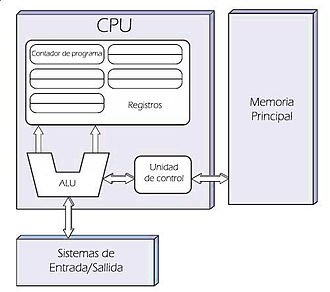

# ¿Qué es Arquitectura de Computadores?

Puede verse como una ciencia o arte que busca la interconexión de diversos 
dispositivos para lograr un objetivo específico de funcionalidad.

# Breve Reseña Histórica de las Generaciones de los Computadores

La idea es que demos un repaso a las diferentes generaciones de los computadores
fijándonos sólo en aspectos que resaltarán entre cada una. Así que iniciemos:

## Primera Generación - La válvula o tubo de vacío (1946-1954)

* 1943 -> ENIAC -> 30 toneladas -> 140 Kw.
* 1946 -> Máquina de John Von Neumann (Arquitectura utilizada hasta nuestros días)
* 1953 -> IBM crea algunas máquinas (701, 704, 709).

## Segunda Generación - El Transistor (1957-1964)

* 1948 -> En los Laboratorios Bell inventaron el transistor y con este desarrollo se ganaron el premio Nobel de física. 
* 1961 -> La empresa Digital Equipment Corporation (DEC) lanza un computador conocido como el PDP-1 con una RAM de 120 KB, basado en transistores y la venta al público era de USD $120.000. En este mismo año IBM lanza el IBM 7090 y tenía 32 KB de RAM
* 1964 -> Sale al mercado el CDC 1600 -> Primera Máquina paralela.

## Tercera Generación - El Circuito Integrado (1964-1971)

* 1964 -> Aparece el S/360 -> Registros de 32 bits con direccionamiento de memoria de 2^24 posiciones.
* 1959 -> Texas Instruments desarrolla el primer circuito integrado con 12 transistores.

## Cuarta Generación - Large Scale Integration (LSI), Very Large Scale Integration (VLSI), Microprocesador (1971-1983)

* Decenas de miles de transistores en un chip (LSI -> Large Scale Integration)
* Cientos de miles de transistores en un chip (VLS -> Very Large Scale Integration)
* Microprocesador.
* Caída de precios por lo que la IBM desarrolla el primer PC.

## Quinta Generación - Very High Scale Integration (VHLSI), PC's (1990-????)

* Very High Large Scale Integration -> millones de transistores. 

# Máquina de Von Neumann

Características: 

* La memoria es unidimensional.
* Existe una sola memoria para almacenar instrucciones y datos. Este concepto varía un poco en la
actualidad donde podemos encontrar comúnmente procesadores con memoria de datos e instrucciones 
a parte.
* Las instrucciones se ejecutan de manera secuencial. Deben existir instrucciones de salto
que permitan romper esta secuencialidad. Esto es aún cierto en la actualidad.

# Clasificación de Arquitecturas

Las arquitecturas de cómputo pueden clasificarse típicamente en 2 grandes grupos:

## Según el número de Instrucciones

Este tipo de clasificación también es conocida como la taxonomía de Flynn y se clasifica en 4 tipos:
* SISD - Single Instruction Single Data. Este tipo de arquitecturas normalmente se ven en celulares 
de gama baja, generalmente presente en sistemas con un sólo núcleo. Se asigna la ejecución de una
sola instrucción sobre un solo dato.
* SIMD - Single Instruction Multiple Data. En este caso una sola instrucción es ejecutada sobre 
un conjunto de datos. Este tipo de arquitecturas tiene como ejemplo a los procesadores vectoriales.
* MIMD - Multiple Instruction Multiple Data - Aquí lo que se tiene es que un conjunto de instrucciones
diferentes se aplica sobre un conjunto de datos distintos. Un ejemplo de este tipo de arquitecturas
puede verse en las GPU, o incluso en sistemas conectados en clúster.
* MISD - Multiple Instruction Single Data. No es una arquitectura típica

## Según el juego de Instrucciones

Existen 2 tipos de arquitecturas de este tipo:

* RISC - Reduce Instruction Set Computer. Este tipo de arquitecturas se caracterizan generalmente
por tener un conjunto de instrucciones de tamaño fijo. La mayoría de procesadores actuales están
basados en este tipo de arquitecturas.
* CISC - Complex Instruction Set Computer. En este caso el conjunto de instrucciones puede tener un 
tamaño variable. Un ejemplo de ésta arquitectura es la arquitectua Intel IA64.

# Power Wall

Es interesante notar que en el diseño de procesadores en la actualidad no se ha notado un incremento
notable en la frecuencia de reloj que éstos tienen. Este problema es conocido como la __Pared de la Potencia__
y es generado ya que cuando un microprocesador trabaja a frecuencias elevadas disipa más potencia
en forma de calor, esto ocasionaría que si comercialmente tuviéramos procesadores que superaran los 
5GHz de manera comercial tuviéramos que conseguir sistemas de enfriamento complejos que elevarían los costos
de los sistemas de cómputo tal y como los conocemos. 

De hecho las personas dedicadas a hacer procesos de __Overclock__ saben que su principal enemigo
es la temperatura, por este motivo los sistemas de prueba que construyen son enfriados con hielo 
seco o inclusive con nitrógeno líquido para mantener una temperatura de funcionamiento adecuada.

A continuación les dejo la ecuación que relaciona la potencia con la frecuencia y el voltaje:

__Power = Capacitive Load * Voltage² * Frecuencia__
