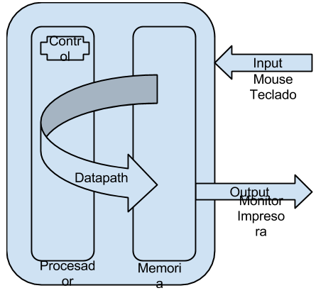

# Clases de Aplicaciones de Cómputo

* Equipos de escritorio (PC’s)
* Equipos servidores. (Utilizados para almacenar bases de datos y a los cuales acceden muchos usuarios)
* Tablets - dispositivos móviles
* Wearables
* Supercomputadores - HPC (High Performance Computing) - GPU : CPU (Sistemas heterogeneos)

## Definición Jerárquica


Cómo puede verse en la gráfica, un sistema de cómputo puede visualizarse como un 
conjunto de círculos concéntricos, donde el más interno se encuentra más cercano al
hardware del computador, luego se tiene el sistema operativo y finalmente todo el
conjunto de aplicaciones que corren sobre el sistema.

# Compiladores

Un compilador puede verse como un traductor de Lenguaje de Alto Nivel a Lenguaje de
Máquina.

Aquí resulta importante que se cuestionen por ejemplo, qué es mejor:

* Un lenguaje Compilado
* Un lenguaje Interpretado

## Ejemplo de Compilación Breve de una suma en SPARCV8

Supongamos que tenemos la siguiente asignación en un lenguaje compilado como C:

```c
c = a + b;
```

El proceso de compilación, en el caso de nosotros se llevará a cabo en 2 fases,
la primera fase es escribir en un lenguaje "intermedio" conocido como ensamblador
la asignación del ejemplo.

```as
add a,b,c
```

Resulta importante aclarar que aquí en el ejemplo estamos usando el nombre de variables
directamente en el lenguaje ensamblador SPARCV8, sin embargo esto no es posible porque
las traducciones deben llevarse a ensamblador y utilizar __registros__, este proceso
se verá más adelante.

Finalmente el lenguaje de máquina serán un conjunto de unos y ceros que serán entendidos
por el procesador:
```
100001000000...
```

Más adelante veremos con detenimiento como se realiza este proceso de manera correcta.
Lo que mostramos aquí es una aproximación al proceso.

# Componentes de un Sistema de Cómputo

Cómo podemos ver en la siguiente gráfica, un sistema de cómputo puede verse como un 
sistema que tiene una entrada, en nuestro caso esta entrada será dada por algún
dispositivo de entrada. Posteriormente estos datos serán llevados hasta
la memoria del sistema, desde donde se tomarán los datos y se llevarán a través de un
datapath y comandado por una unidad de control a través del procesador en el cuál se
realizarán los cálculos necesarios para posteriormente llevar los datos a la memoria
y finalmente llevarlos hasta el usuario a través de algun dispositivo de salida.


