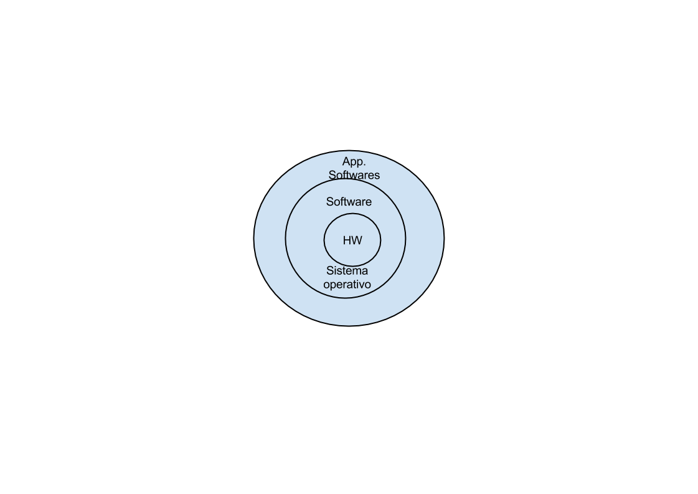

# Clases de Aplicaciones de Cómputo

* Equipos de escritorio (PC’s)
* Equipos servidores. (Utilizados para almacenar bases de datos y a los cuales acceden muchos usuarios)
* Tablets - dispositivos móviles
* Wearables
* Supercomputadores - HPC (High Performance Computing) - GPU : CPU (Sistemas heterogeneos)

## Definición Jerárquica

Cómo puede verse en la gráfica, un sistema de cómputo puede visualizarse como un 
conjunto de círculos concéntricos, donde el más interno se encuentra más cercano al
hardware del computador, luego se tiene el sistema operativo y finalmente todo el
conjunto de aplicaciones que corren sobre el sistema.

# Compiladores
