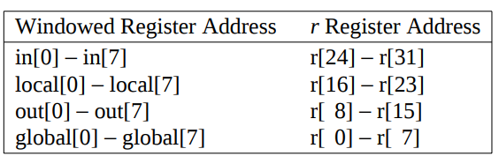

# Instrucciones: El lenguaje del Procesador

Las "palabras" de un procesador se conocen como **Instrucciones** y su vocabulario se suele llamar **Conjunto de Instrucciones**.

## Operaciones del Hardware del Procesador

Como es bien sabido resulta determinante que una arquitectura de cómputo (Procesador), esté en la capacidad de realizar **Operaciones** sobre datos. A estas operaciones normalmente se les pueden llamar Instrucciones, y generalmente son realizadas sobre un máximo de tres elementos, de allí que se conozcan como operaciones **triádicas**. La arquitectura __SPARCV8__ contiene un total de 71 instrucciones aproximadamente, el tamaño de las instrucciones es de 32 bits fijo, lo que permite que sea una arquitectura tipo __RISC__.

Por ejemplo, la instrucción **suma** utilizando variables se puede establecer de la siguiente forma. Recordemos que estamos hablando de una arquitectura **SPARCV8 (Scalable Processor ARChitecture)**:

```c
a = b + c;
```

En ensamblador sería:

```assembly
add b,c,a
```
Tenemos una asignación simple en __C__, donde estamos sumando las variables __b__ y __c__ y guardando el resultado en __a__. Cabe aclarara que para que el ejemplo tenga sentido estamos asumiendo que las tres variables han sido declaradas previamente y adicionalmente que tanto __b__ como __c__ han sido inicializadas.

En el ejemplo, como podemos observar, las variables __b__ y __c__ serán conocidas como operandos y la variable __a__ será nuestra elemento destino, donde se almacenará el resultado de la operación.

El hecho de que se trabaje con instrucciones que a lo sumo serán __triádicas__ le da sentido al primer principio de diseño de toda arquitectura de cómputo en la cual se menciona:

* La simplicidad favorece la regularidad.

Entendiéndose como regularidad a que el procesador deberá funcionar correctamente siempre. Esto tiende a ser mucho más viable si nuestros diseños se mantienen simples.

### Ejemplo de Asignación Compleja

```
h = (l+j) - (p+q);
```

La anterior asignación puede escribirse en lenguaje ensamblador de la siguiente forma:

```assembly
add l,j,l
add p,q,h
sub l,h,h
```
Cómo puede verse se deben realizar 3 instrucciones para efectuar la asignación, esto debido a la utilización de operaciones triádicas.


## Operandos del Hardware del Procesador

Como pudimos observar en el ejemplo anterior estuvimos usando las variables definidas en lenguaje de alto nivel como los operandos de las instrucciones, sin embargo esto no es posible, ya que nuestro procesador sólo puede operar valores almacenados en registros. La arquitectura __SPARCV8 (Scalable Processor ARChitecture)__ permite que dependiendo de la implementación que se realice, se pueda elegir en tener 40 registros o tener 520. La cantidad de registros también depende de la implementación de "Ventanas", lo que veremos más adelante durante el desarrollo del curso.

A continuación tenemos una imagen donde se pueden observar los diferentes tipos de registros que tendrá la arquitectura __SPARCV8__.




Está dividida en:

* **Registros de Entrada**: 8 registros de propósito general. Por estándar se sugiere que sean usados para recibir parámetros.
* **Registros de Salida**: 8 registros de propósito general. Por estándar se sugiere que sean usados para retornar valores.
* **Registros Locales**: 8 registros de propósito general. Por estándar se sugiere que sean usados para definir variables dentro de una función.
* **Registros Globales**: 8 registros de propósito general. Por estándar se sugiere que sean usados para almacenar variables globales

Es claro que la cantidad de registros es bastante reducida. Esto generalmente se da debido al costo que se genera en la construcción de procesadores con __Register Files__ grandes. El hecho de tener pocos registros le da sentido al segundo principio de diseño.

* **Pequeño es más rápido**
